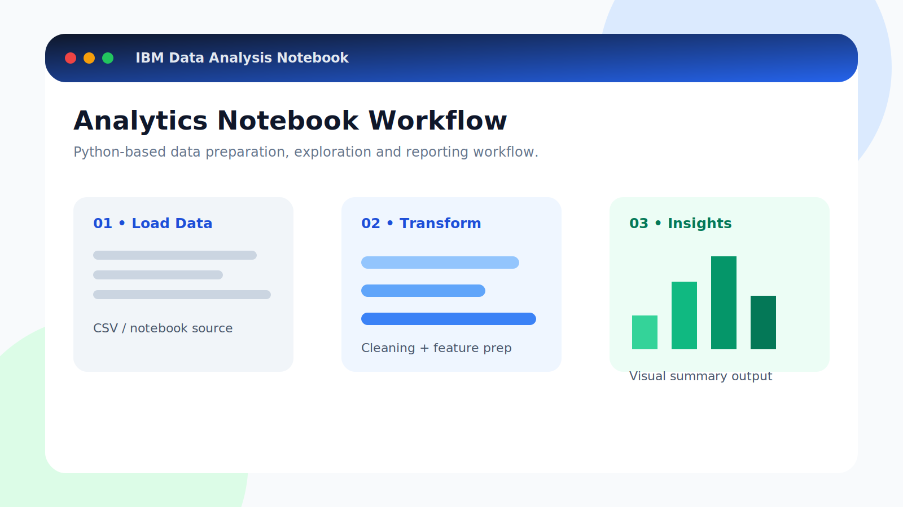
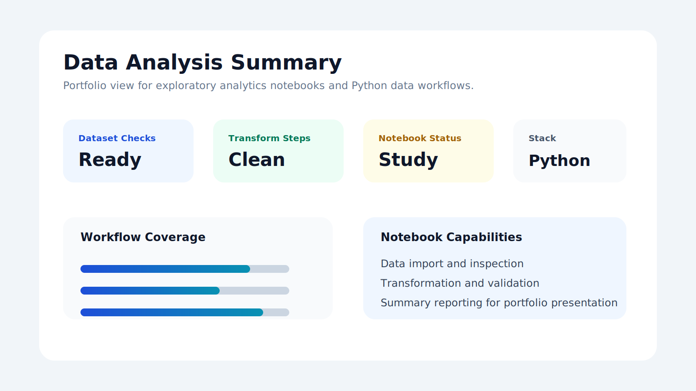

# IBM Data Analysis Notebooks

Study repository for Python notebook-based data analysis workflows.

## Screenshots

## Overview

This repository is intended to organize exploratory analysis notebooks, data cleaning exercises, transformation steps and summary reporting examples.

## Tech Stack

- Python
- Jupyter Notebook
- pandas
- matplotlib

## Current Status

This is a lightweight study/archive repository. To make it stronger for portfolio use, add one polished notebook with a clear problem statement, dataset description, analysis steps, visualizations and conclusion.

## Suggested Next Steps

- Add notebooks under a `notebooks/` folder.
- Add sample data or dataset source notes.
- Add generated charts.
- Add a `requirements.txt` file.
- Document the final insight from each notebook.
